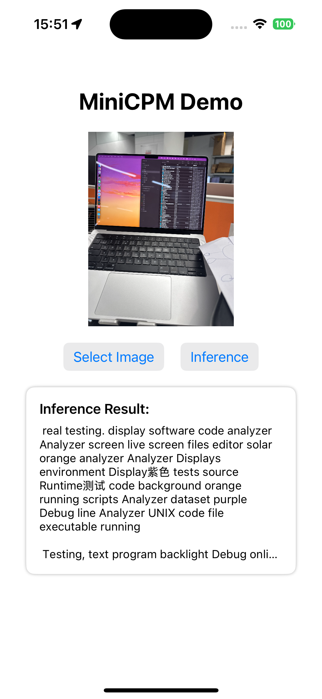

# LLaVA iOS

An iOS visual language assistant application based on [llama.cpp](https://github.com/ggerganov/llama.cpp) and [MiniCPM-V](https://github.com/OpenBMB/MiniCPM-V).

## Introduction

This is a visual language assistant application running on iOS devices, utilizing llama.cpp's iOS library for local inference and MiniCPM-V model for visual language understanding capabilities.

## Models Used

This project uses the following model files:
- `mmproj-model-f16.gguf`: Visual encoding model
- `ggml-model-Q2_K.gguf`: Language model

Models can be downloaded from [Hugging Face](https://huggingface.co/openbmb/MiniCPM-Llama3-V-2_5-gguf/tree/main).

## Features

- Local inference for privacy protection
- Support for image understanding and multi-turn dialogue
- Low resource consumption optimized for mobile devices

## Requirements

- iOS 18.0 or higher
- **Recommended Device**: 11-inch iPad Pro with M4 chip
- Other devices with Neural Engine may experience frequent crashes due to memory constraints

## Device Recommendations

For the best experience and stable performance, we strongly recommend using an 11-inch iPad Pro (M4) for inference. The app has been optimized for this device's capabilities. Other devices, including older iPads and iPhones, might experience frequent crashes due to the computational demands of the visual language model.

## Acknowledgments

- [llama.cpp](https://github.com/ggerganov/llama.cpp) - High-performance inference library
- [MiniCPM-V](https://github.com/OpenBMB/MiniCPM-V) - Open-source visual language model

## License

This project is licensed under the MIT License. See the LICENSE file for details.
